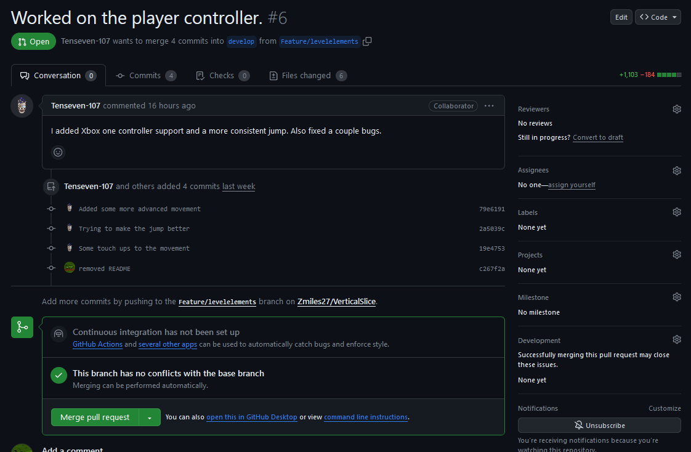

# **Vertical Slice Super Mario 3D World**

    Screenshot van Vertical Slice product.

-
Onze Vertical Slice is een namaak van Super Mario 3D Wrold (2e deel van level 1-1). Dit Project Is gemaakt Door 4 Game Developers en 5 Game Artists.

* Game Developers: Justin.K, Ruben.G, Noah.A en Gerben.P
* Game Artists: Tijn.T, Layan.H, Lynn.D, Ko.H en Imani.J

Dit Project is gemaakt in 10 weken voor een school opdracht door 2e jaars studenten. Het team heeft erg hard gewerkt aan dit project en is erg trots op het resultaat. 

De game kun je downloaden via deze link: https://github.com/Zmiles27/VerticalSlice/releases/new

Veel plezier met spelen!

# 1 OOP scripts

-

# 2 Goed kunnen kijken naar een game
Om goed naar de game te kijken hebben we zelf de game gespeelt en goed geanalyseerd om de movement zo goed mogelijk na te maken. Ook hebben we veel assets opgezocht op internet om reference immages te vinden.

# 3 Gebruiken van Adobe

-

# 4 Afwerken van een game
Om de game een goeie afwerking te geven hebben we heel erg gewerkt aan de movement van de speler tot dat de movement helemaal gepolished was. Ook hebben we veel geëxperimenteerd met animaties tot het resultaat er goed uit zag

# 5 Scripten in kaart brengen met een class diagram

-

# 6 Afspraken over code
Er zijn een paar afspraken gemaakt als het gaat om het coderen. Zo hebben we afgesproken dat elke variabelen met kleine letter beginnen en bij elk woord een hoofdletter wordt gbruikt. Ook hebben we afgesproken om elke functie met een hoofdletter begint.

Als Dev Team hebben we ons behoorlijk gehouden aan de regels maar er waren toch wel plekken waar het team ne verkeerd had geschreven.

# 7 Team Rollen
Er zijn **team Rollen** gemaakt Door het Team zo was **Gerben** de **Lead Developer** en was **Lynn** de **Lead Artist**. Ook is de samenwerking goed gegaan en wist meestal iedereen wat andere aan het doen waren. 

# 8 Gebruik van de DoD
De **Definition Of Done** is goed gebruikt door ons team en gechecked door de Lead Developer van het team zodat de verkeerde Code/Art Files niet op de Develop/Main Branch kwamen te staan.

# 9 Pull Requests
In ons Project hebben we **pull request** gebruikt voor de **Develop Branch** en de **Main Branch** om er voor te zorgen dat er geen confclicten of niet afgemaakte code/art in de belangerijke branches komen.

